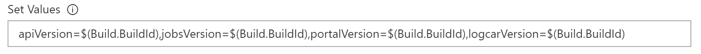

# Helm specific versions

Initially we had a Helm Chart using "latest" for all the container versions. That caused issues where we were not always getting the most up-to-date versions. Instead we changed it to:

1. The Helm Chart values file containing variables for the versions, still all latest:

```yaml
logcarVersion: latest
apiVersion: latest
portalVersion: latest
jobsVersion: latest
```

2. Setting overrides for those values in the Azure DevOps Pipeline:



Those overrides are set to use the BuildId which matches the latest build.

# Test Integration with Azure DevOps

When Azure DevOps is configured to use an external repository for GitHub, the tests that are run in the build pipeline are still applied to GitHub as "checks".

# IPC sidecar

We wanted persistent logging to be deployable via a sidecar container in the pods that needed it. To optimize communication performance between the primary container and the sidecar, we used IPC over Unix Domain Sockets. The socket files were being written to "/tmp/" by default, which was not shared between containers.

1. We had to allow the socketRoot folder to be configurable (using "/shared/" for this example):

```typescript
ipc.config.id = 'logcar';
ipc.config.socketRoot = SOCKET_ROOT;
ipc.config.retry = 1500;
ipc.config.silent = true;
```

2. We had to add a shared folder using "emptyDir" (temporary folder):

```yaml
spec:
    volumes:
    - name: shared
    emptyDir: {}
    containers:
    - name: azupgportal-api
    image: azupgportal.azurecr.io/api:{{.Values.apiVersion}}
    volumeMounts:
    - name: shared
        mountPath: /shared
    ports:
    - containerPort: {{.Values.apiPort}}
        name: http
    env:
    - name: LOG_LEVEL
        value: '{{.Values.apiLogLevel}}'
    - name: PORT
        value: '{{.Values.apiPort}}'
    - name: SOCKET_ROOT
        value: /shared/
    - name: azupgportal-api-logcar
    image: azupgportal.azurecr.io/logcar:{{.Values.logcarVersion}}
    volumeMounts:
    - name: shared
        mountPath: /shared
    env:
    - name: LOG_LEVEL
        value: '{{.Values.apiLogLevel}}'
    - name: STORAGE_ACCOUNT
        valueFrom:
        secretKeyRef:
            name: {{.Values.storageSecret}}
            key: STORAGE_ACCOUNT
    - name: STORAGE_KEY
        valueFrom:
        secretKeyRef:
            name: {{.Values.storageSecret}}
            key: STORAGE_KEY
    - name: SOCKET_ROOT
        value: /shared/
```

# Smaller branches

Using branches for a smaller number of changes made it easier to review and deploy.

# Assertions

Given the number of unit tests and the number of things we are checking in each test, it is beneficial to use the following pattern for assertions whereby the failure will give some meaningful explanation of the actual problem.

```typescript
assert.equal(
    verify.data.status,
    'closed',
    `job "${create.data.id}" status is "${
        verify.data.status
    }" instead of "closed".`
);
```
