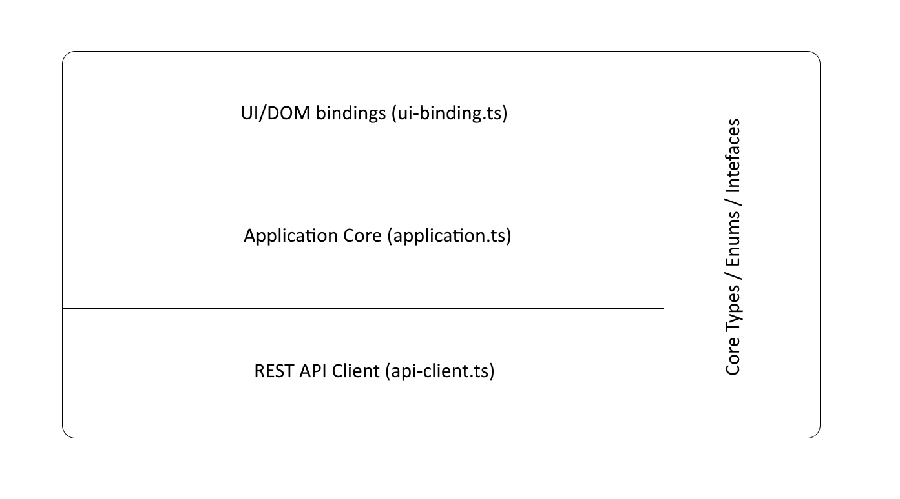

# Portal UI Overview

### Overview

The UI for the Azure Upgrade Portal is broken out into the following architecture:

Based on this layout, note this split between core logic and the UI-specific code. This was done in order to keep the UI event logic and DOM manipulation out of the core orchestration logic to enable testing.

Currently, all UI/DOM specific code is in the `ui-bindings.ts` file, which also defines an interface that any implementations of the UI must implement. This interface is used in the test harnesses to provide a virtualized view of the UI without having to run an in-memory DOM.

Moving forward, the following areas will need broken out as independant sub-sections / files:

-   Re-used UI components, such as the data grids, control groupings, etc.
-   Resource strings.

### Considerations

Note this application used jQuery 3.3.1, and not more popular frameworks such as React or Angular. This was due primarily do the structure of the application being decoupled from any specific UX paradigm and forcing relatively simple manipulations. Additionally, the team has reasonable familiarity with the chained methods style supported by jQuery, specifically around event binding and tiggering.
